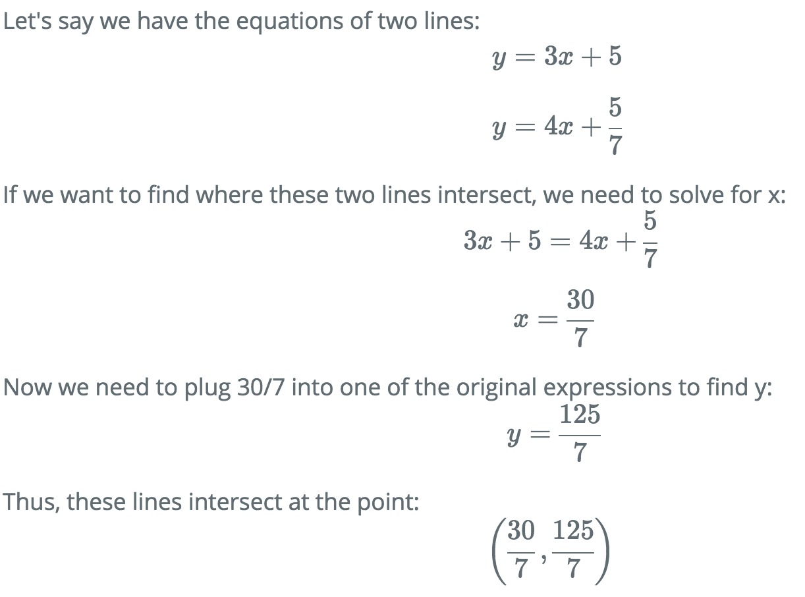
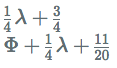

# algebra.js

- [Basics](#basics)
    - [Fractions](#fractions)
    - [Expressions](#expressions)
        - [Single Variable](#expressions-single-variable)
        - [Multiple Variables](#expressions-multiple-variables)
        - [Evaluate](#expressions-evaluate)
    - [Equations](#equations)
        - [Solve with Single Variable](#equations-single-variable)
        - [Solve with Multiple Variables](#equations-multiple-variables)
        - [Right Hand Side Options](#equations-right-hand-side-options)
- [LaTeX](#latex)
    - [Tutorial-Like Example](#latex-tutorial-like-example)
    - [Greek Letters](#latex-greek-letters)
- [Usage](#usage)
    - [In Node](#usage-in-node)
    - [In the Browser](#usage-in-browser)

# <a name="basics"></a> Basics 

Numbers need to be either a fraction or an integer. Currently, only linear expressions and equations are supported. 
The main classes available are Fraction, Expression, and Equation.

```js
var Fraction = algebra.Fraction;
var Expression = algebra.Expression;
var Equation = algebra.Equation;
```

## <a name="fractions"></a> Fractions 

Add, subtract, multiply, and divide fractions by either integers or other fractions. Fractions are not automatically 
reduced.

```js
var frac = new Fraction(1, 2);
console.log(frac.print());

frac = frac.subtract(5);
console.log(frac.print());

frac = frac.multiply(new Fraction(6, 7));
console.log(frac.print());

frac = frac.reduce();
console.log(frac.print());
```

```
1/2
-9/2
-54/14
-27/7
```

## <a name="expressions"></a> Expressions 

Initialize expressions with a variable name. Add integers, fractions, or other expressions to expressions.
Multiply and divide expressions by either integers or fractions. Evaluate expressions by substituting in fractions or 
integers for variables.

### <a name="expressions-single-variable"></a> Single Variable

```js
var x = new Expression("x");
x = x.add(5);
x = x.divide(4);

console.log(x.print());
```

```
1/4x + 5/4
```

### <a name="expressions-multiple-variables"></a> Multiple Variables

Expressions can have multiple variables.

```js
var expr = new Expression("x").subtract(new Expression("y")).add(3);
console.log(expr.print());
```

```
x - y + 3
```

When adding / subtracting an expression to / from another expression, any like-terms will be combined.

```js
var a = new Expression("a");
var b = new Expression("b");
var c = new Expression("c");

var expr1 = a.add(b).add(c);
var expr2 = c.subtract(b);

console.log(expr1.print());
console.log(expr2.print());

var expr3 = expr1.add(expr2);

console.log(expr3.print());
```

```
a + b + c
c - b
a + 2c
```

### <a name="expressions-evaluate"></a> Evaluate

Evaluating an expression for all of its variables returns a reduced fraction object. Evaluating for only some of its 
variables returns an expression object.

```js
var expr = new Expression("x").divide(6).add(new Expression("y").multiply(2));
console.log(expr.print());

var eval1 = expr.evaluateAt({'y': 3});
console.log(eval1.print());

var eval2 = expr.evaluateAt({'y': 3, 'x': new Fraction(1, 2)});
console.log(eval2.print());
```

```
1/6x + 2y
1/6x + 6
73/12
```

## <a name="equations"></a> Equations

Build an equation by setting an expression equal to another expression or to an integer or fraction. Solve for
a variable with `Equation.solveFor(variable)`.

### <a name="equations-single-variable"></a> Solve with Single Variable

If the equation only has one variable, solving for that variable will return a reduced fraction object.

```js
var x1 = new Expression("x").add(new Fraction(2, 3)).divide(5);
var x2 = new Expression("x").divide(7).add(4);

var eq = new Equation(x1, x2);
console.log(eq.print());

var answer = eq.solveFor("x");

console.log("x = " + answer.print());
```

```
1/5x + 2/15 = 1/7x + 4
x = 203/3
```

### <a name="equations-multiple-variables"></a> Solve with Multiple Variables

If the equation contains more than one variable, solving for a variable will return an expression.

```js
var x = new Expression("x").add(5).divide(4);
var y = new Expression("y").subtract(new Fraction(4, 5)).multiply(3);

var eq = new Equation(x, y);

console.log(eq.print());

var xAnswer = eq.solveFor("x");
var yAnswer = eq.solveFor("y");

console.log("x = " + xAnswer.print());
console.log("y = " + yAnswer.print());
```

```
1/4x + 5/4 = 3y - 12/5
x = 12y - 73/5
y = 1/12x + 73/60
```

### <a name="equations-right-hand-side-options"></a> Right Hand Side Options

You can also specify an integer or fraction as the right hand side of the equation.

```js
var z = new Expression("z").subtract(4).divide(9);

var eq1 = new Equation(z, 0);

console.log(eq1.print());
console.log("z = " + eq1.solveFor("z").print());

var eq2 = new Equation(z, new Fraction(1, 4));

console.log(eq2.print());
console.log("z = " + eq2.solveFor("z").print());
```

```
1/9z - 4/9 = 0
z = 4
1/9z - 4/9 = 1/4
z = 25/4
```

# <a name="latex"></a> LaTeX

Make things pretty with LaTeX. All classes have a `.tex()` method for rendering LaTeX. Combining this with
 [KaTeX](https://github.com/Khan/KaTeX), for example, is easy.

## <a name="latex-tutorial-like-example"></a> Tutorial-Like Example

```html
<div id="tutorial"></div>

<script>
appendLatex = function(latex) {
    var div = document.getElementById("tutorial");
    var newDiv = document.createElement("div");
    div.appendChild(newDiv);
    katex.render(latex, newDiv);
}

appendText = function(text) {
    var div = document.getElementById("tutorial");
    var newDiv = document.createElement("div");
    div.appendChild(newDiv);
    newDiv.innerHTML = text;
}

var LETTER = "x";
var SLOPE1 = 3;
var SLOPE2 = 4;
var INTERCEPT1 = 5
var INTERCEPT2 = new Fraction(5, 7);

var expr1 = new Expression(LETTER).multiply(SLOPE1).add(INTERCEPT1);
var expr2 = new Expression(LETTER).multiply(SLOPE2).add(INTERCEPT2);

appendText("Let's say we have the equations of two lines:");
appendLatex("y = " + expr1.tex());
appendLatex("y = " + expr2.tex());

appendText("If we want to find where these two lines intersect, we need to solve for " + LETTER + ":");

var eq = new Equation(expr1, expr2);
appendLatex(eq.tex());

var x = eq.solveFor(LETTER);
appendLatex(LETTER + " = " + x.tex());

appendText("Now we need to plug " + x.print() + " into one of the original expressions to find y:");

var y = expr1.evaluateAt({'x': x});
appendLatex("y = " + y.tex());

appendText("Thus, these lines intersect at the point:");
appendLatex("(" + x.tex() + "," + y.tex() + ")");
</script>
```



## <a name="latex-greek-letters"></a> Greek Letters

Also supports Greek letters, obviously!

```html
<div>
    <div id="div1"></div>
    <div id="div2"></div>
</div>

<script>
var div1 = document.getElementById("div1");
var div2 = document.getElementById("div2");

var lambda = new Expression("lambda").add(3).divide(4);
var Phi = new Expression("Phi").subtract(new Fraction(1, 5)).add(lambda);

katex.render(lambda.tex(), div1);
katex.render(Phi.tex(), div2);
</script>
```



See [here](https://www.sharelatex.com/learn/List_of_Greek_letters_and_math_symbols#Greek_letters) for a full list of 
all the Greek letters available.

# <a name="usage"></a> Usage

## <a name="usage-in-node"></a> In Node

```
$ git clone https://github.com/nicolewhite/algebra.js.git
$ cd algebra
$ node
```

```js
var algebra = require('./algebra');
```

## <a name="usage-in-browser"></a> In the Browser

Download `algebra.min.js` from <a href="http://algebra.js.org">here</a>.

```html
<script src="algebra.min.js"></script>
```
